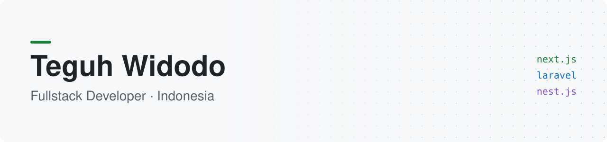
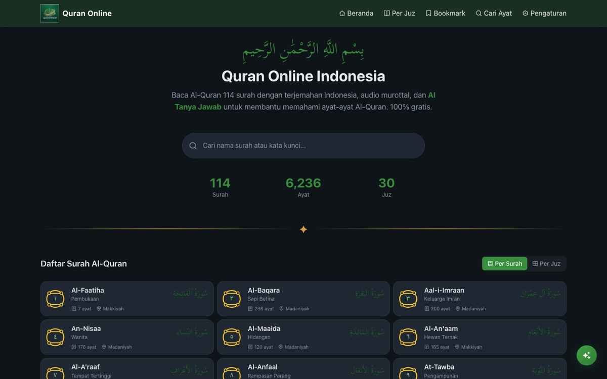
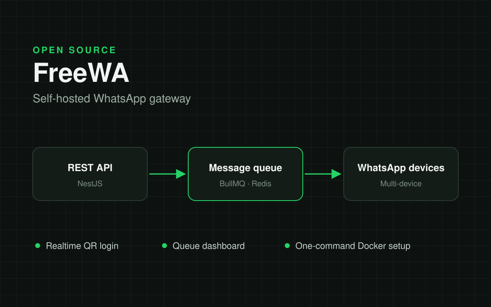
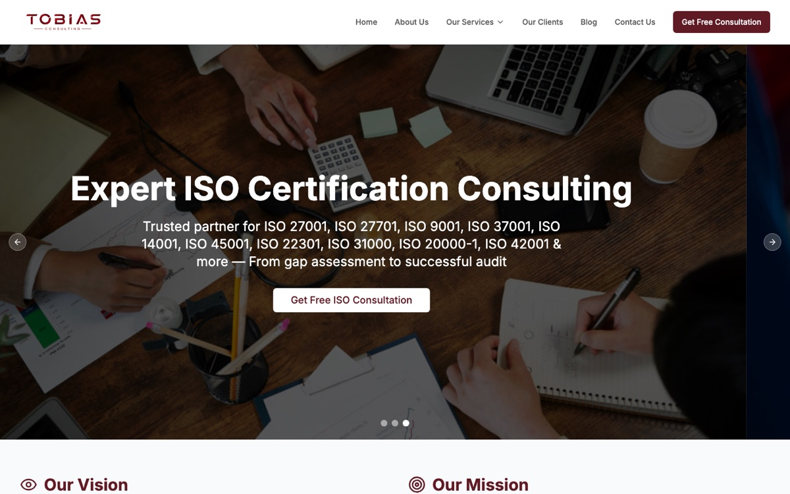
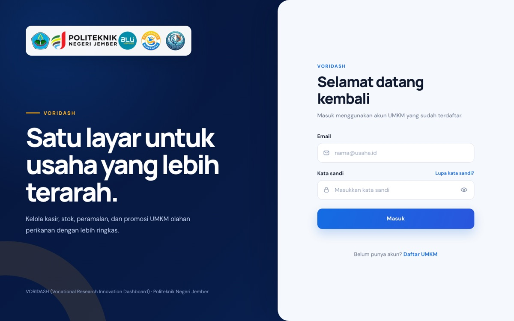

<picture>
  <source media="(prefers-color-scheme: dark)" srcset="assets/banner-dark.svg">
  
</picture>

I build web apps and internal tools for businesses, and help agencies ship client work.
6+ years with Next.js, React and NestJS.

[teguhcoding.com](https://teguhcoding.com) · [WhatsApp](https://wa.me/6285868474405) · [teguhwin8@gmail.com](mailto:teguhwin8@gmail.com)

### Selected work

<table>
  <tr>
    <td width="50%" valign="top">
      
       <b><a href="https://quranonline.teguhcoding.com">Quran Online</a></b>
       Quran reader with audio recitation and AI Q&amp;A.
    </td>
    <td width="50%" valign="top">
      
       <b><a href="https://github.com/teguhwin8/freewa">FreeWA</a></b>
       Self-hosted WhatsApp gateway with a message queue.
    </td>
  </tr>
  <tr>
    <td width="50%" valign="top">
      
       <b><a href="https://tobiasconsulting.co.id">Tobias Consulting</a></b>
       Company website for an ISO and cybersecurity consultancy.
    </td>
    <td width="50%" valign="top">
      
       <b><a href="https://cindy-olive.vercel.app">Voridash</a></b>
       Sales, stock and forecasting dashboard for small food businesses.
    </td>
  </tr>
</table>

Have a project or need an extra developer? [Message me on WhatsApp](https://wa.me/6285868474405).
